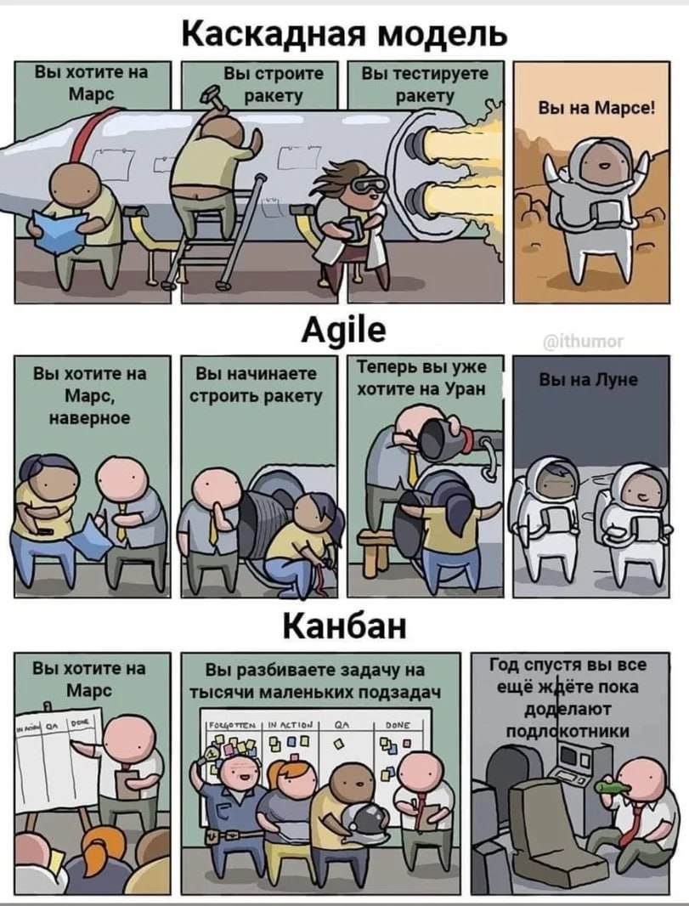
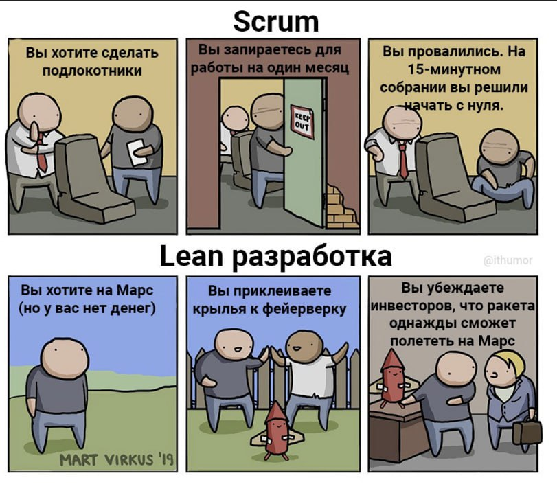

### Введение

Любая серьезная работа начинается с постановки задачи и составлению технического задания (ТЗ).

### А зачем ТЗ, у нас же есть Agile?

Agile - это про организацию работы команды, он не заменит ТЗ.

Хотя если вы обладаете огромным бюджетом, в вашем проекте задействовано множество разработчиков и нет четкой конечно цели, 
то стоит выбрать Agile подход вместо стандартного ТЗ. А в качестве результата можно показывать красивые графики сгорания пустых задач в JIRA.

`У самурая нет цели, только путь.`

Есть отличная картинка на эту тему, родом из Reddit. Правда автор сделал ошибку: Agile — это не отдельная методика.
Scrum, Kanban — это варианты реализации Agile.

### Мы выбираем ТЗ 

При работе с заказчиком нельзя допустить:

 - срыв сроков;
 - выход за границы бюджета.

Вот тут на помощь и приходит ТЗ. Оно выполняет ряд важных функций:

- Фиксирует договоренности Заказчика и Разработчика, о том как должна выглядеть система и что она должна делать.
- Защищает Разработчика от неожиданных фантазий по функционалу со стороны Заказчика.
- Защищает Заказчика от попыток Разработчика сделать "залипуху". 

В России есть **Единая система программной документации (ЕСПД)** - система стандартов, устанавливающих взаимосвязанные правила разработки, 
оформления и обращения программ и программной документации. 

Техническое задание пишется согласно двум ГОСТам:

- [ГОСТ 34.602.89 «Техническое задание на создание автоматизированной системы»](http://docplace.ru/gostr34/gost3460289/);
- [ГОСТ 19.201-78 «Техническое задание. Требования к содержанию и оформлению»](http://docplace.ru/gost19/gost1920178/).

Если вы разрабатываете документацию на программу, которую создали под конкретное предприятие, то ваш [ГОСТ 34](http://docplace.ru/gostr34/gost3460289/). 
Если же пишете документы на массовую программу, то ваш [ГОСТ 19](http://docplace.ru/gost19/gost1920178/).

### Источники

[Как написать Техническое задание по ГОСТу | СЭД "Кодекс: документооборот"](https://kodeksdoc.ru/kak-napisat-texnicheskoe-zadanie-po-gostu/)
